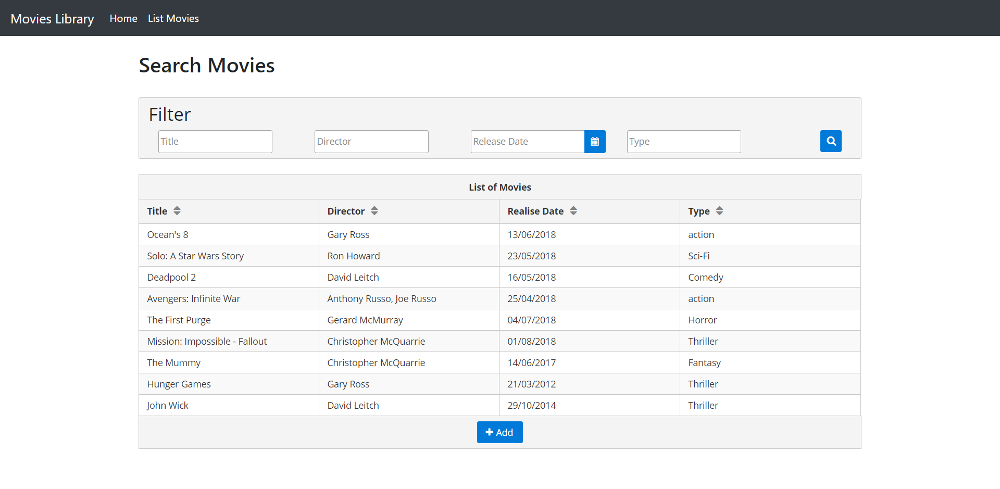
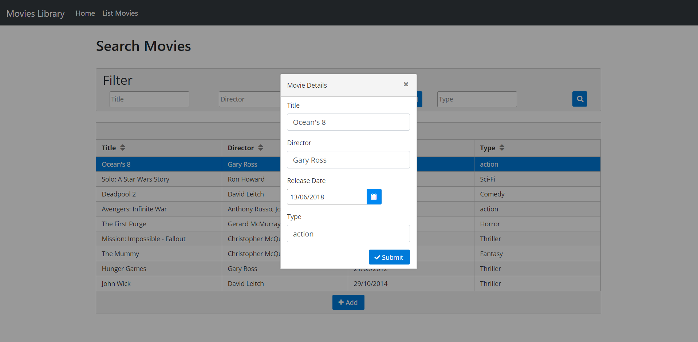
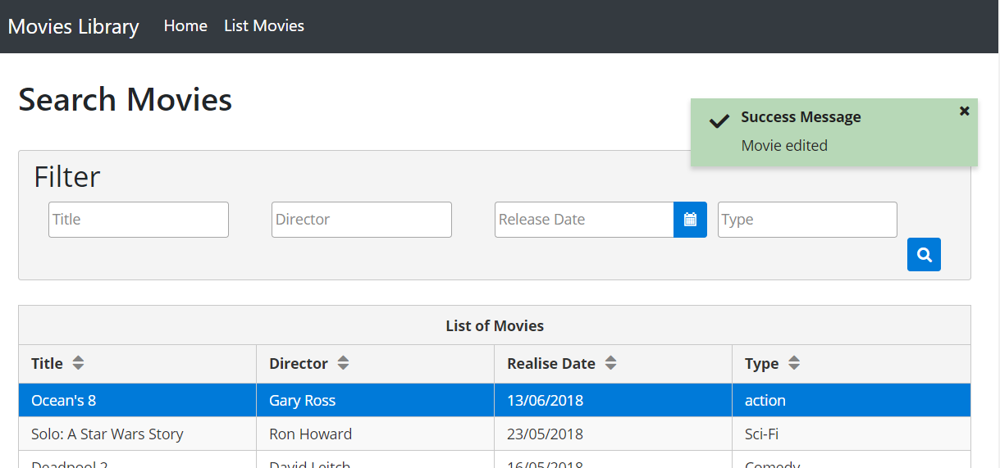
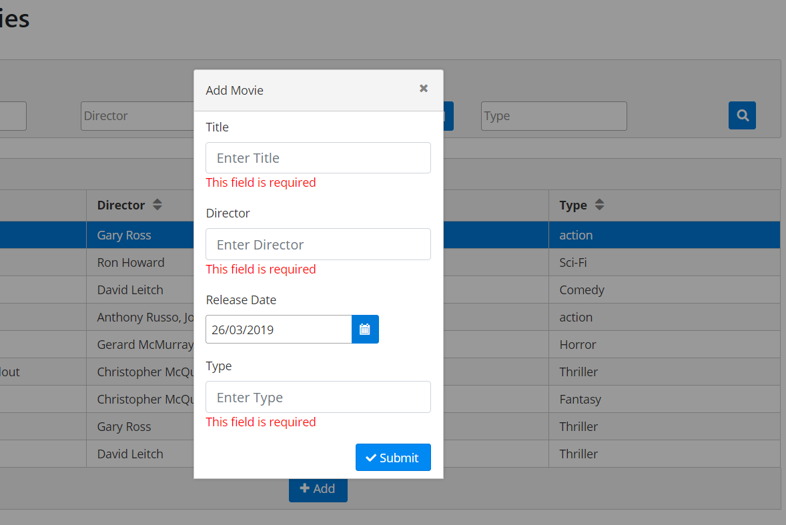

# movie-library-Spring-Angular

This project contains a  front End Angular Application

The idea is to create a responsive front-end that consumes a RESTful web service that we will create. Users will be able to create their movies (or select movies if they already exist in the Json File ).

This project contains a back-end Spring Boot server retrieving data from a movies.json file using REST Api services exposed at http://localhost:8080/moviesLibrary. The Api controller contains view, creation, update, search and delete services.

 It is possible de view all data or to use an index to search one object. There is also another service, based on a key-value search criteria. In addition, a delete and update operations are available to modify objects list content. An integrity check is added before every process to control input parameters.

#Features of this project include:

Add Movie
Update Movie
Delete Movie
Search Movie

#Framework

Backend: Spring Boot
Frontend: Angular6

#FrontEnd Dependencies

PrimeNg 6
Bootstrap 4

#BackEnd Dependencies

Tomcat Spring Boot
Gson

#Server

Tomcat 

#Setup

Clone this directory

FrontEnd : 
1) Do "npm install" for install the dependency
2) "npm build" vg db  for build the dist folder

BackEnd : 
1) Do Maven Install for MovieLibrary Folder and copy the war on webapp folder of tomcat 
2) Start the Server it will create folder  MovieLibrary on webapp
3) copy the content of frontEnd dist on the last folder Created on webApp 

